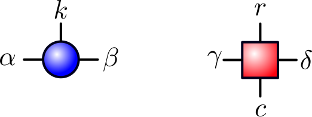

# MatrixProductStates (MPS)

Julia package providing a basic implementation of an MPS code for learning and experimenting.

## Installation

MatrixProductStates is a Julia package and can be installed directly from GitHub. To do so go to the package manager mode via

```
julia> ]
```

and type 

```
pkg> add https://github.com/kuehnste/mps.jl
```

Alternatively you can clone the repository to your machine navigate inside the project folder and install it in dev mode via

```
pkg> dev .
```

Afterwards the package can be used via 

```
julia> using MatrixProductStates
```


## Indexing convention for tensors

The MPS and MPO tensors are represented as 3 and 4 dimensional Arrays respectively. The convention for ordering the indices is shown in the figure below.



For MPS tensors, the convention is (α, β, k) where  α (β) ranges form 1 to D <sub>l</sub> ( D <sub>r</sub>), the dimension of the left (right) virtual index and k from 1 to d, the dimension of the physical index. Similarly for MPO tensors the convention is (γ, δ, r, c) where the Greek symbols again refer to the virtual indices and r, c both range from 1 to d, the dimension of the physical index. For a fixed combination of the virtual indices γ and δ, the resulting operator has r as row index and c as column index. Thus, with this convention applying an operator to a wave function results in the following diagrammatic notation.


## License

This project is licensed under the MIT License - see the [LICENSE](LICENSE) file for details.

## References

There a vast amount of literature on MPS and more general tensor network methods available. The following incomplete list of reviews and references therein might provide a useful starting point for learning more about MPS and more general tensor networks.

* [F. Verstraete, V. Murg, J. Cirac, Adv. Phys. 57, 143 (2008)](https://doi.org/10.1080/14789940801912366)
* [U. Schollwöck, Ann. Phys. 326, January 2011 Special Issue, 96 (2011)](https://doi.org/10.1016/j.aop.2010.09.012)
* [R. Orús, Ann. Phys. 349, 117 (2014)](https://doi.org/10.1016/j.aop.2014.06.013)
* [J. C. Bridgeman, C. T. Chubb, J. Phys. A 50, 223001 (2017)](https://doi.org/10.1088/1751-8121/aa6dc3)

## Authors

* [**Stefan Kühn**](https://github.com/kuehnste)

## Acknowledgments

Parts of the implementation follow the sample code provided in [F. Verstraete, V. Murg, J. Cirac, Adv. Phys. 57, 143 (2008)](https://doi.org/10.1080/14789940801912366)
